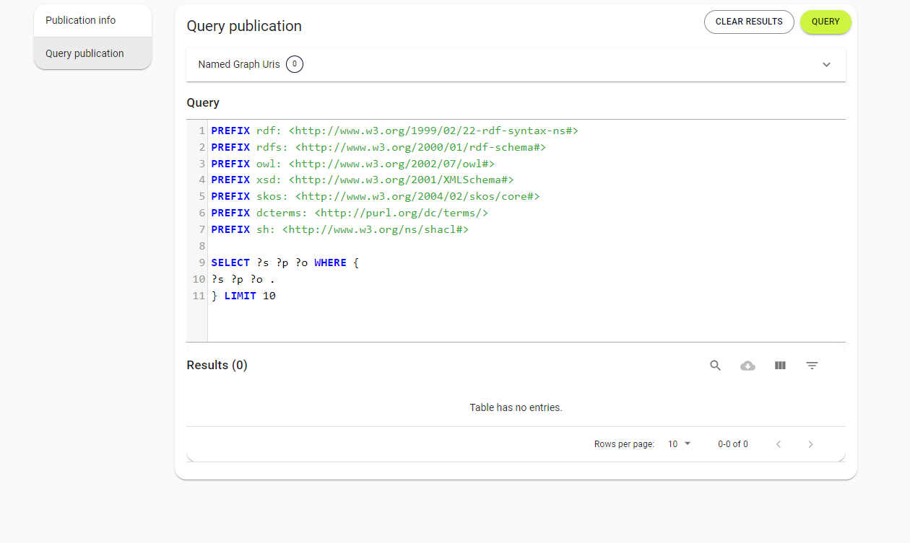

# Inleiding

## Doel documentatie
Dit document is de gebruikershandleiding voor gebruik van de linked data publicatie van de <abbr title="Nederlandse CAD-standaard">NLCS</abbr>, met toelichting op werken met linked data, beschikbare query's en publicatievormen.

Deze handleiding gebruikt bij query's de voorbeelden van de eerste linked data publicatie, NLCS 5-0-2.

## Van SQL naar linked data

### ID's uit oude SQL database 
De linkeddata publicatie bevat de oude nummering uit de sql database. Daarmee kunnen de oude tabellen worden nagebootst.
Op verzoek van de NLCS leveranciers zijn in versie 5.1 ook nieuwe ID's aangemaakt.

## Sparql-endpoint
Het SPARQL-Endpoint is de plek waar de  NLCS publicatie rechtstreeks benaderbaar is voor systemen zoals eigen developmentomgevingen, bijvoorbeeld vanuit postman, op dit moment zonder dat je een login nog hebt. Om het sparql-endpoint te benaderen gebruik je de volledige naam van de publicatie dus met /sparql achter de naam:

* NLCS: https://hub.laces.tech/digitalbuildingdata/nlcs/live/nlcs/sparql

Met de dynamische url benader je altijd de laatste versie van de publicatie. 
Je kunt ook een statische url gebruiken per publicatie, voor 5.0.2 is dat bijvoorbeeld: http://hub.laces.tech/digitalbuildingdata/nlcs/live/nlcs/versions/5_0_2/sparql

### Acceptatie-omgeving 
In de acceptatie-omgeving van het sparql endpoint staan de concept versies voor reviews, tests door de technische commissie en openbare consultaties. Daar vind je op dit moment de volgende publicaties, ik geef hier alleen de dynamische url's weer:

* NLCS Accpetatiie: http://hub.laces.tech/digitalbuildingdata/nlcs/acceptance/nlcs-acceptatie/sparql
* NLCS-GWSW: http://hub.laces.tech/digitalbuildingdata/nlcs/acceptance/beta-example-nlcs-gwsw/sparql
* NLCS-BGT: http://hub.laces.tech/digitalbuildingdata/nlcs/acceptance/nlcs-bgt/sparql

## LinkedData Hub
De [linkedData Hub](ttps://hub.laces.tech/digitalbuildingdata/nlcs) is een interface voor menselijke gebruikers van de publicaties. Je moet hiervoor een gratis persoonlijk account aanmaken. Je kunt er zien welke versies er gepubliceerd zijn van de NLCS. De omgeving biedt ook de mogelijkheid om sparql-queries uit te voeren en .ttl-files te downloaden.

<figure>

<figcaption>De datahub voor NLCS publicaties</caption>
</figure>

Als je op één van beide omgevingen in de hub klikt, zie je dit:

### Publicaties

<figure>

<figcaption>De beschikbare publicaties</caption>
</figure>

### Details publicatie
Als je op de publicatie klikt, zie je dit:

<figure>

<figcaption>Details van een publicatie</caption>
</figure>

### Query's uitvoeren
Als je klikt op "query publication" kun je query's uitvoeren. Het resultaat kan gedownload worden als csv.

<figure>

<figcaption>Scherm waarmee je een query kunt uitvoeren</caption>
</figure>

