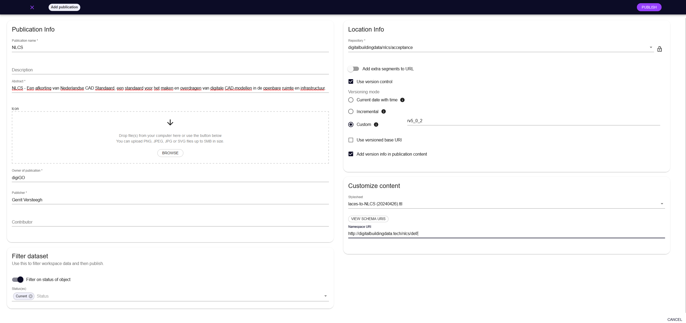

# Publicatie nieuwe versie 

## Publicatie linked data platform

Eerst wordt een test-release gedaan, die alleen de product manager kan inzien en controleren. Vervolgens wordt de concept-release gedaan, voor tests en openbare consultatie.

<figure>

<figcaption>invulvelden in de LACES Publicatieomgeving</caption>
</figure>

Invullen release:
* Publication name volgt de versie van NLCS
* Description, korte omschrijving release zelfde als op de releasepagina van digiGO
* Abstract, iets uitgebreidere omschrijving
* Owner of Publication: DigiGO
* Publisher, de naam van de beheerder van de database die op dat moment de publicatie doet
* Contributor, eventueel naam van co-autheur van versiewijziging
* Filter on status object aan zetten, alleen de current waarden worden gepubliceerd
* Location infor, selecteer de test, acceptance of live omgfeving van NLCS
* Geen extra delen aan de URL toevoegen
* Zet use version control aan
* Geef met custom de naam van de versie op
* Vinkje aan van add version info in publication content
* Customize content: voor elke versie moet een eigen styulesheet gemaakt worden, zowel voor concept als definitief, zodat de juiste linkjes naar de arceringen en symbolen in de publicatie komen. De stylesheet wordt beheerd door Semmtech.
* Namespace URI: http://digitalbuildingdata.tech/nlcs/def/

### Aanpassen stylesheet
Voordat de nieuwe publicatie wordt gedraaid, moet een nieuwe stylesheet gemaakt worden:

- [ ] Check of er nieuwe onderdelen zijn in de structuur van de publicatie
- [ ] Vanwege de opname van versienummers in de links van de arceringen/symbolen/lijntypes moet de stylesheet per publicatie aangepast worden om de juiste link te bieden.
- [ ] Check of alles op "current" staan en niet op "concept"
- [ ] Check of alle objecten het aspect discipline en status hebben. Anders worden de objecten niet getoond in de query's.
- [ ] Ckeck of er verboden tekens staan in laagnamen, en _ en - alleen op de juiste plek als scheidingsteken gebruikt worden.

## Publicaties op GitHub

Merk op dat acceptatie- en definitieve releases een eigen branch hebben op GitHub, zie [hier](#github-releases) de uitleg.

### Tabellen 
- [ ] Gebruik de [NLCS Exporter](https://github.com/nl-digigo/NLCS/tree/acceptance/code/nlcs/nlcs_exporter) om tabellen te genereren.

Deze exporter genereert de volgende tabellen.  

* De outputtabellen worden gegenereerd als ondersteuning voor omzetten van de linked data publicatie naar tabellen het hoofdgroepen, nlcs-objectentabellen, symbolen enzovoorts.
* Een changelog wordt uitgedraaid met nieuwe, gewijzigde en vervallen objecten.

- [ ] Sla de op als csv bestand in [Tabellen-GitHub](https://github.com/nl-digigo/NLCS/tree/main/tabellen) in de juiste branch

### Query's 
- [ ] Als het informatiemodel is aangepast, moeten de query's opnieuw worden gepubliceerd.

De query's van de actuele versie staan op [Query's - Actueel](https://github.com/nl-digigo/NLCS/tree/main/code/actueel) .

### Symbolen
- [ ] De autocad symbolen staan in [Symbolen](https://github.com/nl-digigo/NLCS/tree/main/symbolen/autocad); in de juiste branch 
- [ ] Omdat de symbolen apart beheerd worden van de database moet altijd gecontroleerd worden of wijzigingen op twee plekken zijn doorgevoerd. 
- [ ] De transformatie naar Microstation gebeurt door een Expert van The People Group en wordt logischerwijzer onder /microstation geplaatst

### Arceringen
- [ ] De autocad arceringen staan in [Arceringen](https://github.com/nl-digigo/NLCS/tree/main/arceringen); in de juiste branch
- [ ] De .PAT bestanden worden automatisch gegenereerd uit de database. Dit garandeert dat alle arceringen uit de publicatie ook aanwezig zijn. Dit gebeurt met [dit script](https://github.com/nl-digigo/NLCS/blob/main/beheer/generateLIN-PATfiles/generatePAT.ipynb)

### Lijntypes
De lijntypes staan in [Lijntypes](https://github.com/nl-digigo/NLCS/tree/main/lijntypes); in de juiste branch

- [ ] Er moet uit de database een .LIN bestand worden gehaald. Dit gebeurt met [dit script](https://github.com/nl-digigo/NLCS/blob/main/beheer/generateLIN-PATfiles/generateLIN.ipynb)
- [ ] Bijwerken .SHX bestand: Lijntypes kunnen zijn aangevuld met een SHAPE uit de NLCS.SHX. 
- [ ] SHX bestand opschonen, niet in database staande shapes verwijderen

### Plotinstellingen
- [ ] De plotinstellingen (.ctb) van een controle-versie staan in [Plotinstellingen](https://github.com/nl-digigo/NLCS/tree/main/plotinstellingen); waarbij de actuele versie in de map actueel staat, eerdere versies in de map archief en in ontwikkeling zijnde nieuwe versies in de map ontwikkeling.

### Documentatie
De documentatie staat onder docs. Daarbij geldt: het vastgestelde ReSpec-document van de actuele versie heeft altijd dezelfde statische link; zowel oudere vastgestelde versies als de versie in ontwikkeling staan in het mapje van het actuele document onder "ontwikkeling" ofwel in "archief". Voor reviewversies is een eigen folder beschikbaar bij elk document.

- [ ] Archiveren oude versies van de documentatie
- [ ] Publiceren nieuwe versies van de documentatie

## Updaten mappingen
Na het maken van de nieuwe release, is het tijd om de mappings te updaten:

- [ ] Update mapping GWSW-NLCS
- [ ] Update mapping BGT-NLCS
- [ ] Update mapping Verkeersbordenportaal George - NLCS

## Kwaliteitscontrole test-release
Voor het publiceren van een concept of een definitieve versie wordt de release als test-versie gepubliceerd en gecontroleerd. Daarin worden de volgende stappen ondernomen om fouten te voorkomen:

1. Controle op basis van scripts
2. Experttoets van outputtabellen, symbolen en arceringen
3. Voornemen digiGO: toets door een softwareleverancier op het kunnen verwerken van de publicatie

### Controlescripts
* De volgende controles worden uitgedraaid bij gebruik van de nlcs-exporter:
  * [query: afwijkendeURIs](https://github.com/nl-digigo/NLCS/blob/acceptance/code/nlcs/controlesdatabase/afwijkendeURIs.rq) controleert of er afwijkende URI's worden gebruikt, alle URI's moeten binnen de namespace "http://digitalbuildingdata.tech/nlcs/def/" passen.
  * [query: controle_arceringsymbool_zonder_objectRelatie](https://github.com/nl-digigo/NLCS/blob/acceptance/code/nlcs/controlesdatabase/controle_arceringsymbool_zonder_objectRelatie.rq) controleert of er symbolen of arceringen zijn zonder relatie naar een object. Merk op, dat de relatie ALTIJD vanaf een bovenliggende "zoekterm" wordt gelegd. 
  * [query: controle_laagnaam_relaties_parentchild_saobject](https://github.com/nl-digigo/NLCS/blob/acceptance/code/nlcs/controlesdatabase/controle_laagnaam_relaties_parentchild_saobject.rq) controleert of er niet zowel een kind als een ouder - relatie zit tusen NLCS-object en symbool dan wel arcering. 
  * [query: controle_lijntypes_zonder_objectRelatie](https://github.com/nl-digigo/NLCS/blob/acceptance/code/nlcs/controlesdatabase/controle_lijntypes_zonder_objectRelatie.rq) controleert of alle lijntypes zijn gekoppeld aan een object, zo niet het lijntype verwijderen. In de beheeromgeving zijn de lijntypes niet gekoppeld aan de objecten.
  * [query: controle_nietBestaande_lijntype_in_object](https://github.com/nl-digigo/NLCS/blob/acceptance/code/nlcs/controlesdatabase/controle_nietBestaande_lijntype_in_object.rq) controleert of er verwezen wordt naar een niet-bestaand lijntype.
  * [query: controle_nlcs-objecten_te_veel_subobjecten](https://github.com/nl-digigo/NLCS/blob/acceptance/code/nlcs/controlesdatabase/controle_nlcs-objecten_te_veel_subobjecten.rq) checkt of er NLCS-objecten met meer dan 5 subobjecten zijn. Meer mogen er niet in een laagnaam staan.
  * [query: identiekenamen](https://github.com/nl-digigo/NLCS/blob/acceptance/code/nlcs/controlesdatabase/identiekenamen.rq) draaien om te controleren of er dubbele namen voorkomen bij concepten. Bij de symbolen is dit soms zo, doordat we refereren aan groepen en een bestand soms dezelfde naam heeft als de groep. Andere dubbelingen moeten worden verwijderd in de publicatie. 

  

  

  

  

  

Als er geen exports meer uitkomen bij de controlesquery's is de release goed.

### Expertcontroles uitvoeren

1. Controle op de exports uit de database
Hier staan de de [outputtabellen](https://github.com/nl-digigo/NLCS/tree/acceptance/tabellen).
Veelvoorkomende fouten: 
  * Aspecten (Status en Discipline), moet je ook waardelijst koppelen in de beheeromgeving; anders wordt het NLCS-object niet gepubliceerd. 
  * Informatie-attributen (NLCS-objecten, symbolen, arceringen, lijntypes): alles van een status moet zijn ingevuld, anders wordt deze informatie niet gepubliceerd.

Checklist:

- [ ] AL
- [ ] AM
- [ ] BC
- [ ] BV
- [ ] ES
- [ ] FC
- [ ] FV
- [ ] GC
- [ ] GK
- [ ] GR
- [ ] GW
- [ ] HC
- [ ] HU
- [ ] IE
- [ ] IS
- [ ] IV
- [ ] IW
- [ ] KC
- [ ] KG
- [ ] KL
- [ ] KW
- [ ] MC
- [ ] MO
- [ ] MW
- [ ] OB
- [ ] OG
- [ ] OV
- [ ] RI
- [ ] SB
- [ ] SC
- [ ] VH
- [ ] VS
- [ ] VV
- [ ] VW
- [ ] WH
- [ ] ZZ

- [ ] Abibliotheken
- [ ] Arceringen
- [ ] Bewerkingen
- [ ] Disciplines
- [ ] Hoofdgroepen
- [ ] Lijnkleuren
- [ ] Lijntypes
- [ ] Lijnweights
- [ ] Sbibliotheken
- [ ] Statussen
- [ ] Symbolen
- [ ] all_objects
- [ ] objectenmetlijntypesmetscraps

2. Controle ID's
- [ ] Controleer (in de outputtabellen) of alles een ID heeft & geen dubbele ID. 

- [ ] Check bij de vervallen NLCS-OBjecten, of er een object met dezelfde naam is in de nieuwe release

- [ ] Er moet gecontroleerd worden of alle SHAPES die genoemd worden bij een lijntype ook daadwerkelijk voorkomen in de NLCS.SHX.

3. Controle symbolen
- [ ] Controleer of de symbolen goed werken in AutoCAD, geoptimaliseerd zijn & een preview hebben
- [ ] Controleer of alle symbolen in de database ook als bestand beschikbaar zijn <a href="#footnote-2">[2]</a>.

[2] Een lijst maken van de bestanden in de directory kan:
1. In de command prompt change directory cd [padnaam]; op deze locatie een bestand aanmaken met naam fileslist.txt; dan in command prompt dit typen: met dir /b /s > fileslist.txt 
2. In windows 11 PowerShell: cd "padnaam" en dan: Get-ChildItem -Path . -Recurse -Name > fileslist.txt
Controleren kan in Excel, vergelijk of de tekst in twee kolommen gelijk is met deze formule: =ALS(A1=B1; "Gelijk"; "Niet gelijk")

4. Controle arceringen
- [ ] Controleer of de .PAT bestanden goed werken

5. Controle lijntypes
- [ ] Controleer of de .LIN beastanden goed zijn
- [ ] controleer of de .SHX file compleet is

### Expertcontroles mappingen

De mappingen naar GWSW en BGT worden pas opgesteld als de nieuwe versie formeel geaccepteerd is voor publicatie. 

Daarna dienen de volgende controles uitgevoerd te worden:
- [ ] Zijn de objecten uit BGT of GWSW allemaal nog gekoppeld aan een actieve ID?

