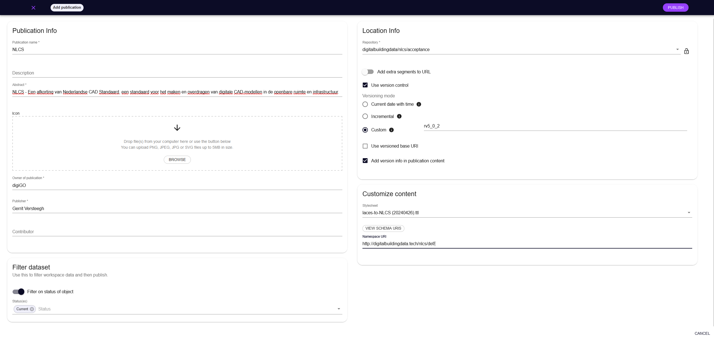

# Publicatie nieuwe versie 

## Publicatie linked data platform

Eerst wordt een test-release gedaan, die alleen de product manager kan inzien en controleren. Vervolgens wordt de concept-release gedaan, voor tests en openbare consultatie.

<figure>

<figcaption>invulvelden in de LACES Publicatieomgeving</caption>
</figure>

Invullen release:
* Publication name volgt de versie van NLCS
* Description, korte omschrijving release zelfde als op de releasepagina van digiGO
* Abstract, iets uitgebreidere omschrijving
* Owner of Publication: DigiGO
* Publisher, de naam van de beheerder van de database die op dat moment de publicatie doet
* Contributor, eventueel naam van co-autheur van versiewijziging
* Filter on status object aan zetten, alleen de current waarden worden gepubliceerd
* Location infor, selecteer de test, acceptance of live omgfeving van NLCS
* Geen extra delen aan de URL toevoegen
* Zet use version control aan
* Geef met custom de naam van de versie op
* Vinkje aan van add version info in publication content
* Customize content: voor elke versie moet een eigen styulesheet gemaakt worden, zowel voor concept als definitief, zodat de juiste linkjes naar de arceringen en symbolen in de publicatie komen. De stylesheet wordt beheerd door Semmtech.
* Namespace URI: http://digitalbuildingdata.tech/nlcs/def/

### Aanpassen stylesheet
Voordat de nieuwe publicatie wordt gedraaid, moet een nieuwe stylesheet gemaakt worden:

- [ ] Check of er nieuwe onderdelen zijn in de structuur van de publicatie
- [ ] Vanwege de opname van versienummers in de links van de arceringen/symbolen/lijntypes moet de stylesheet per publicatie aangepast worden om de juiste link te bieden.
- [ ] Check of alles op "current" staan en niet op "concept"
- [ ] Check of alle objecten het aspect discipline en status hebben. Anders worden de objecten niet getoond in de query's.
- [ ] Ckeck of er verboden tekens staan in laagnamen, en _ en - alleen op de juiste plek als scheidingsteken gebruikt worden.

## Publicaties op GitHub

Merk op dat acceptatie- en definitieve releases een eigen branch hebben op GitHub, zie [hier](#github-releases) de uitleg.

### Tabellen 
- [ ] Gebruik de [NLCS Exporter](https://github.com/nl-digigo/NLCS/tree/acceptance/code/nlcs/nlcs_exporter) om tabellen te genereren.

Deze exporter genereert de volgende tabellen.  

* De outputtabellen worden gegenereerd als ondersteuning voor omzetten van de linked data publicatie naar tabellen het hoofdgroepen, nlcs-objectentabellen, symbolen enzovoorts.
* Een changelog wordt uitgedraaid met nieuwe, gewijzigde en vervallen objecten.

- [ ] Sla de op als csv bestand in [Tabellen-GitHub](https://github.com/nl-digigo/NLCS/tree/main/tabellen) in de juiste branch

### Query's 
- [ ] Als het informatiemodel is aangepast, moeten de query's opnieuw worden gepubliceerd.

De query's van de actuele versie staan op [Query's - Actueel](https://github.com/nl-digigo/NLCS/tree/main/code/actueel) .

### Symbolen
Regels voor het aanpassen van symbolen: als alleen de inhoud wordt gewijzigd, blijven URI, naam en ID in de database behouden. Als de bestandsnaam wijzigt, moet het oude symbool in de database vervallen en wordt een nieuw symbool met nieuwe URI en ID gemaakt. Dit zorgt er voor, dat de wijzigingen goed kunnen worden doorgevoerd in individuele bibliotheken en bij transformeren van bestaande tekeningen naar een nieuwe versie van de standaard.
- [ ] De autocad symbolen staan in [Symbolen](https://github.com/nl-digigo/NLCS/tree/main/symbolen/autocad); in de juiste branch 
- [ ] Omdat de symbolen apart beheerd worden van de database moet altijd gecontroleerd worden of wijzigingen op twee plekken zijn doorgevoerd. 
- [ ] De transformatie naar Microstation gebeurt door een Expert van The People Group en wordt logischerwijzer onder /microstation geplaatst

### Arceringen
Regels voor het aanpassen van arceringen: als alleen de inhoud wordt gewijzigd, blijven URI, naam en ID in de database behouden. Als de bestandsnaam wijzigt, moet de oude arcering in de database vervallen en wordt een nieuwe arcering met nieuwe URI en ID gemaakt. Dit zorgt er voor, dat de wijzigingen goed kunnen worden doorgevoerd in individuele bibliotheken en bij transformeren van bestaande tekeningen naar een nieuwe versie van de standaard.
- [ ] De autocad arceringen staan in [Arceringen](https://github.com/nl-digigo/NLCS/tree/main/arceringen); in de juiste branch
- [ ] De .PAT bestanden worden automatisch gegenereerd uit de database. Dit garandeert dat alle arceringen uit de publicatie ook aanwezig zijn. Dit gebeurt met [dit script](https://github.com/nl-digigo/NLCS/blob/main/beheer/generateLIN-PATfiles/generatePAT.ipynb)

### Lijntypes
Regels voor het aanpassen van lijntypes: als alleen de inhoud wordt gewijzigd, blijven URI, naam en ID in de database behouden. Als de bestandsnaam wijzigt, moet het oude lijntype in de database vervallen en wordt een nieuw lijntype met nieuwe URI en ID gemaakt. Dit zorgt er voor, dat de wijzigingen goed kunnen worden doorgevoerd in individuele bibliotheken en bij transformeren van bestaande tekeningen naar een nieuwe versie van de standaard.

De lijntypes staan in [Lijntypes](https://github.com/nl-digigo/NLCS/tree/main/lijntypes); in de juiste branch

- [ ] Er moet uit de database een .LIN bestand worden gehaald. Dit gebeurt met [dit script](https://github.com/nl-digigo/NLCS/blob/main/beheer/generateLIN-PATfiles/generateLIN.ipynb)
- [ ] Bijwerken .SHX bestand: Lijntypes kunnen zijn aangevuld met een SHAPE uit de NLCS.SHX. 
- [ ] SHX bestand opschonen, niet in database staande shapes verwijderen

### Plotinstellingen
- [ ] De plotinstellingen (.ctb) van een controle-versie staan in [Plotinstellingen](https://github.com/nl-digigo/NLCS/tree/main/plotinstellingen); waarbij de actuele versie in de map actueel staat, eerdere versies in de map archief en in ontwikkeling zijnde nieuwe versies in de map ontwikkeling.

### Documentatie
De documentatie staat onder docs. Daarbij geldt: het vastgestelde ReSpec-document van de actuele versie heeft altijd dezelfde statische link; zowel oudere vastgestelde versies als de versie in ontwikkeling staan in het mapje van het actuele document onder "ontwikkeling" ofwel in "archief". Voor reviewversies is een eigen folder beschikbaar bij elk document.

- [ ] Archiveren oude versies van de documentatie
- [ ] Publiceren nieuwe versies van de documentatie

## Updaten mappingen
Na het maken van de nieuwe release, is het tijd om de mappings te updaten:

- [ ] Update mapping GWSW-NLCS
- [ ] Update mapping BGT-NLCS
- [ ] Update mapping Verkeersbordenportaal George - NLCS

## Kwaliteitscontrole test-release
Voor het publiceren van een concept of een definitieve versie wordt de release als test-versie gepubliceerd en gecontroleerd. Daarin worden de volgende stappen ondernomen om fouten te voorkomen:

1. Controle op basis van scripts
2. Experttoets van outputtabellen, symbolen en arceringen
3. Voornemen digiGO: toets door een softwareleverancier op het kunnen verwerken van de publicatie

#### Niet-toegestane tekens in namen

In laag-, symbool-, arcering- en lijntypenamen zijn spaties toegestaan en wordt <code>.</code> als decimaalteken gebruikt. De volgende tekens zijn <strong>niet</strong> toegestaan omdat ze technisch onmogelijk of foutgevoelig zijn in CAD-systemen (AutoCAD, MicroStation) of LISP-tools breken:

<ul id="niet-toegestane-tekens">
  <li><code>\</code> en <code>/</code> — tekenscheiding, niet toegestaan (AutoCAD, MicroStation)</li>
  <li><code>,</code> (komma) — breekt de DXF-uitwisseling; gebruik een <code>.</code> als decimaalteken</li>
  <li><code>[</code> en <code>]</code> — blokhaken, niet toegestaan</li>
  <li><code>&lt;</code> <code>&gt;</code> <code>=</code> <code>?</code> — niet toegestaan (AutoCAD &amp; MicroStation; <code>?</code> is een jokerteken)</li>
  <li><code>*</code> <code>|</code> <code>:</code> — niet toegestaan (AutoCAD; <code>*</code> is een jokerteken, <code>|</code> een xref-scheiding)</li>
  <li><code>`</code> (accent grave) — niet toegestaan (AutoCAD)</li>
  <li><code>(</code> <code>)</code> <code>;</code> <code>"</code> <code>'</code> — breken LISP-tools (haakjes vormen de expressie, <code>;</code> is een commentaarteken, aanhalingstekens begrenzen tekenreeksen)</li>
</ul>

Deze lijst is mogelijk niet volledig; controleer bij twijfel bij de NLCS-expertcommissie. Hoofdletters zijn de norm, met als uitzondering elementsymbolen uit het periodiek systeem (koper = <code>Cu</code>) en eenheden waar de hoofdletter verschil maakt (<code>mm</code> vs <code>Mm</code>). Kleine letters worden daarom niet als fout gemeld maar apart, informatief, getoond.

### Controle objectentabel

<table class="kwaliteitscontrole objecten">
  <thead>
    <tr><th>Kwaliteitscontrole</th><th class="jn">Exporter-tool</th><th class="jn">Handmatig</th><th>Objectchangelog-tool</th></tr>
  </thead>
  <tbody>
    <tr>
      <td><code>controle_nlcs-objecten_te_veel_subobjecten</code> — checkt of er NLCS-objecten met meer dan 5 subobjecten zijn. Meer mogen er niet in een laagnaam staan.</td>
      <td class="ja"><a href="https://github.com/nl-digigo/NLCS/blob/development/code/nlcs/controlesdatabase/controle_nlcs-objecten_te_veel_subobjecten.rq">Ja</a></td><td class="nee">Nee</td>
      <td>Ja — tabblad <em>Objectenboom</em></td>
    </tr>
    <tr>
      <td>Naam-/laagnaamhiërarchie: elk onderliggend object heeft precies één segment meer dan zijn ouder, de oudernaam staat exact vooraan (prefix) en het scheidingsteken (- of _) klopt</td>
      <td class="nee">Nee</td><td class="nee">Nee</td>
      <td>Ja — tabblad <em>Objectenboom</em></td>
    </tr>
    <tr>
      <td>Check bij de vervallen NLCS-objecten, of er een object met dezelfde naam is in de nieuwe release</td>
      <td class="nee">Nee</td><td class="ja">Ja</td>
      <td>Ja — vervallen objecten met een naamgenoot in de nieuwe release krijgen in de changelog een <em>naamgenoot</em>-markering</td>
    </tr>
    <tr>
      <td>Controleer of elk object voor alle NLCS-statussen (Bestaand, Nieuw, Vervallen, Tijdelijk) een visualisatie heeft; AL en ZZ hebben alleen een visualisatie voor de bestaande situatie
<strong>Tip:</strong> kleuren, lijntypes, lijndiktes: alles van een status moet zijn ingevuld, anders wordt deze informatie niet gepubliceerd.
</td>
      <td class="nee">Nee</td><td class="ja">Ja</td>
      <td>Ja — tabblad <em>Fase-visualisatie</em></td>
    </tr>
    <tr>
      <td>Controleer (in de outputtabellen) of alles een ID heeft &amp; geen dubbele ID.</td>
      <td class="nee">Nee</td><td class="ja">Ja</td>
      <td>Ja — tabblad <em>ID's</em></td>
    </tr>
    <tr>
      <td><code>identiekenamen</code> — draaien om te controleren of er dubbele namen voorkomen bij concepten. Bij de symbolen is dit soms zo, doordat we refereren aan groepen en een bestand soms dezelfde naam heeft als de groep. Andere dubbelingen moeten worden verwijderd in de publicatie.</td>
      <td class="ja"><a href="https://github.com/nl-digigo/NLCS/blob/development/code/nlcs/controlesdatabase/identiekenamen.rq">Ja</a></td><td class="nee">Nee</td>
      <td>Ja — tabblad <em>Dubbele namen</em>: namen die binnen één hoofdgroep meer dan eens voorkomen</td>
    </tr>
    <tr>
      <td>Element-koppeling: als de kolom <code>element</code> een S (symbool) of A (arcering) bevat, moet er ook een <code>sobject</code> resp. <code>aobject</code> zijn ingevuld — en omgekeerd</td>
      <td class="nee">Nee</td><td class="ja">Ja</td>
      <td>Ja — tabblad <em>Element-koppeling</em></td>
    </tr>
    <tr>
      <td>Element gevuld: de kolom <code>element</code> van elk object bevat minimaal één waarde (G = geometrie, A = arcering, S = symbool en/of T = tekst)</td>
      <td class="nee">Nee</td><td class="ja">Ja</td>
      <td>Ja — controle <em>Element gevuld</em></td>
    </tr>
    <tr>
      <td>Zoekterm-dekking: elke <code>sobject</code>-/<code>aobject</code>-waarde in een object moet minstens één symbool resp. arcering vinden (de zoekterm moet als tekst in de symbool-/arceringnaam voorkomen)</td>
      <td class="nee">Nee</td><td class="ja">Ja</td>
      <td>Ja — tabblad <em>Zoekterm-treffers</em></td>
    </tr>
    <tr>
      <td>Speciale tekens in de naam: geen niet-toegestane tekens (zie <a href="#niet-toegestane-tekens">Niet-toegestane tekens in namen</a>); spaties en <code>.</code> als decimaalteken zijn wel toegestaan</td>
      <td class="nee">Nee</td><td class="ja">Ja</td>
      <td>Ja — tabblad <em>Speciale tekens</em></td>
    </tr>
    <tr>
      <td>Versievergelijking: nieuwe, gewijzigde en vervallen regels t.o.v. de vorige versie</td>
      <td class="nee">Nee</td><td class="nee">Nee</td>
      <td>Ja — changelog objecten</td>
    </tr>
  </tbody>
</table>

Veelvoorkomende fouten: 
  * Aspecten (Status en Discipline), moet je ook waardelijst koppelen in de beheeromgeving; anders wordt het NLCS-object niet gepubliceerd. 

### Controles symbolen

<table class="kwaliteitscontrole symbolen">
  <thead>
    <tr><th>Kwaliteitscontrole</th><th class="jn">Exporter-tool</th><th class="jn">Handmatig</th><th>Objectchangelog-tool</th></tr>
  </thead>
  <tbody>
    <tr>
      <td><code>controle_arceringsymbool_zonder_objectRelatie</code> — controleert of er symbolen of arceringen zijn zonder relatie naar een object.</td>
      <td class="ja"><a href="https://github.com/nl-digigo/NLCS/blob/development/code/nlcs/controlesdatabase/controle_arceringsymbool_zonder_objectRelatie.rq">Ja</a></td><td class="nee">Nee</td>
      <td>Ja — tabblad <em>Zoekterm-controle</em>: symbolen die via geen enkele zoekterm (sobject) in de objectentabel gevonden worden</td>
    </tr>
    <tr>
      <td>Controleer of de symbolen goed werken in AutoCAD, geoptimaliseerd zijn &amp; een preview hebben</td>
      <td class="nee">Nee</td><td class="ja">Ja</td>
      <td>Nee</td>
    </tr>
    <tr>
      <td>Controleer of alle symbolen in de database ook als bestand beschikbaar zijn</td>
      <td class="nee">Nee</td><td class="ja">Ja</td>
      <td>Ja — de symbolen-changelog toont per rij ".dwg aanwezig" en de rapporten <em>regel-zonder-dwg</em> / <em>dwg-zonder-tabelregel</em></td>
    </tr>
    <tr>
      <td>Consistentie fase/optie t.o.v. de gecodeerde naam (voorvoegsel V-/B- → fase, achtervoegsel -SO/-S/… → optie)</td>
      <td class="nee">Nee</td><td class="nee">Nee</td>
      <td>Ja — tabblad <em>Optie-fase-check</em></td>
    </tr>
    <tr>
      <td>Controleer (in de outputtabellen) of alles een ID heeft &amp; geen dubbele ID.</td>
      <td class="nee">Nee</td><td class="ja">Ja</td>
      <td>Ja — tabblad <em>ID's</em></td>
    </tr>
    <tr>
      <td><code>identiekenamen</code> — draaien om te controleren of er dubbele namen voorkomen bij concepten. Bij de symbolen is dit soms zo, doordat we refereren aan groepen en een bestand soms dezelfde naam heeft als de groep. Andere dubbelingen moeten worden verwijderd in de publicatie.</td>
      <td class="ja"><a href="https://github.com/nl-digigo/NLCS/blob/development/code/nlcs/controlesdatabase/identiekenamen.rq">Ja</a></td><td class="nee">Nee</td>
      <td>Ja — tabblad <em>Dubbele namen</em>: namen die binnen één hoofdgroep meer dan eens voorkomen</td>
    </tr>
    <tr>
      <td>Informatie-attributen (NLCS-objecten, symbolen, arceringen, lijntypes): alles van een status moet zijn ingevuld, anders wordt deze informatie niet gepubliceerd.</td>
      <td class="nee">Nee</td><td class="ja">Ja</td>
      <td>Nee</td>
    </tr>
    <tr>
      <td>Speciale tekens in de naam: geen niet-toegestane tekens (zie <a href="#niet-toegestane-tekens">Niet-toegestane tekens in namen</a>); spaties en <code>.</code> als decimaalteken zijn wel toegestaan</td>
      <td class="nee">Nee</td><td class="ja">Ja</td>
      <td>Ja — tabblad <em>Speciale tekens</em></td>
    </tr>
    <tr>
      <td>Versievergelijking: nieuwe, gewijzigde en vervallen regels t.o.v. de vorige versie</td>
      <td class="nee">Nee</td><td class="nee">Nee</td>
      <td>Ja — changelog symbolen</td>
    </tr>
  </tbody>
</table>

### Controles arceringen

<table class="kwaliteitscontrole arceringen">
  <thead>
    <tr><th>Kwaliteitscontrole</th><th class="jn">Exporter-tool</th><th class="jn">Handmatig</th><th>Objectchangelog-tool</th></tr>
  </thead>
  <tbody>
    <tr>
      <td><code>controle_arceringsymbool_zonder_objectRelatie</code> — controleert of er symbolen of arceringen zijn zonder relatie naar een object.</td>
      <td class="ja"><a href="https://github.com/nl-digigo/NLCS/blob/development/code/nlcs/controlesdatabase/controle_arceringsymbool_zonder_objectRelatie.rq">Ja</a></td><td class="nee">Nee</td>
      <td>Ja — tabblad <em>Zoekterm-controle</em>: arceringen die via geen enkele zoekterm (aobject) in de objectentabel gevonden worden</td>
    </tr>
    <tr>
      <td>Controleer of de .PAT bestanden goed werken</td>
      <td class="nee">Nee</td><td class="ja">Ja</td>
      <td>Nee</td>
    </tr>
    <tr>
      <td>Consistentie fase/optie t.o.v. de gecodeerde naam (voorvoegsel V-/B- → fase, achtervoegsel -SO/-S/… → optie)</td>
      <td class="nee">Nee</td><td class="nee">Nee</td>
      <td>Ja — tabblad <em>Optie-fase-check</em></td>
    </tr>
    <tr>
      <td>Controleer (in de outputtabellen) of alles een ID heeft &amp; geen dubbele ID.</td>
      <td class="nee">Nee</td><td class="ja">Ja</td>
      <td>Ja — tabblad <em>ID's</em></td>
    </tr>
    <tr>
      <td><code>identiekenamen</code> — draaien om te controleren of er dubbele namen voorkomen bij concepten. Bij de symbolen is dit soms zo, doordat we refereren aan groepen en een bestand soms dezelfde naam heeft als de groep. Andere dubbelingen moeten worden verwijderd in de publicatie.</td>
      <td class="ja"><a href="https://github.com/nl-digigo/NLCS/blob/development/code/nlcs/controlesdatabase/identiekenamen.rq">Ja</a></td><td class="nee">Nee</td>
      <td>Ja — tabblad <em>Dubbele namen</em>: namen die binnen één hoofdgroep meer dan eens voorkomen</td>
    </tr>
    <tr>
      <td>Informatie-attributen (NLCS-objecten, symbolen, arceringen, lijntypes): alles van een status moet zijn ingevuld, anders wordt deze informatie niet gepubliceerd.</td>
      <td class="nee">Nee</td><td class="ja">Ja</td>
      <td>Nee</td>
    </tr>
    <tr>
      <td>Speciale tekens in de naam: geen niet-toegestane tekens (zie <a href="#niet-toegestane-tekens">Niet-toegestane tekens in namen</a>); spaties en <code>.</code> als decimaalteken zijn wel toegestaan</td>
      <td class="nee">Nee</td><td class="ja">Ja</td>
      <td>Ja — tabblad <em>Speciale tekens</em></td>
    </tr>
    <tr>
      <td>Verklaring: elke arcering heeft een (lange) verklaring in de kolom <code>vrkl_lang</code> (de tekst voor de legenda/verklaring)</td>
      <td class="nee">Nee</td><td class="ja">Ja</td>
      <td>Ja — tabblad <em>Verklaring</em></td>
    </tr>
    <tr>
      <td>Naamlengte: de arceringnaam (kolom <code>arcering</code>) is maximaal 31 tekens lang</td>
      <td class="nee">Nee</td><td class="ja">Ja</td>
      <td>Ja — controle <em>Naamlengte</em></td>
    </tr>
    <tr>
      <td>Versievergelijking: nieuwe, gewijzigde en vervallen regels t.o.v. de vorige versie</td>
      <td class="nee">Nee</td><td class="nee">Nee</td>
      <td>Ja — changelog arceringen</td>
    </tr>
  </tbody>
</table>

### Controles lijntypes
<table class="kwaliteitscontrole lijntypes">
  <thead>
    <tr><th>Kwaliteitscontrole</th><th class="jn">Exporter-tool</th><th class="jn">Handmatig</th><th>Objectchangelog-tool</th></tr>
  </thead>
  <tbody>
    <tr>
      <td><code>controle_lijntypes_zonder_objectRelatie</code> — controleert of alle lijntypes zijn gekoppeld aan een object, zo niet het lijntype verwijderen. In de beheeromgeving zijn de lijntypes niet gekoppeld aan de objecten.</td>
      <td class="ja"><a href="https://github.com/nl-digigo/NLCS/blob/development/code/nlcs/controlesdatabase/controle_lijntypes_zonder_objectRelatie.rq">Ja</a></td><td class="nee">Nee</td>
      <td>Ja — tabblad <em>Lijntype-gebruik</em>: lijntypes die bestaan maar in geen enkel object (lt_b/lt_n/lt_v/lt_t) gebruikt worden</td>
    </tr>
    <tr>
      <td><code>controle_nietBestaande_lijntype_in_object</code> — controleert of er verwezen wordt naar een niet-bestaand lijntype.</td>
      <td class="ja"><a href="https://github.com/nl-digigo/NLCS/blob/development/code/nlcs/controlesdatabase/controle_nietBestaande_lijntype_in_object.rq">Ja</a></td><td class="nee">Nee</td>
      <td>Deels — de tool berekent dit intern (check_lijntype_usage), maar toont het bewust niet in de interface</td>
    </tr>
    <tr>
      <td>Er moet gecontroleerd worden of alle SHAPES die genoemd worden bij een lijntype ook daadwerkelijk voorkomen in de NLCS.SHX.</td>
      <td class="nee">Nee</td><td class="ja">Ja</td>
      <td>Nee</td>
    </tr>
    <tr>
      <td>Controleer of de .LIN bestanden goed zijn</td>
      <td class="nee">Nee</td><td class="ja">Ja</td>
      <td>Nee</td>
    </tr>
    <tr>
      <td>Controleer of de .SHX file compleet is</td>
      <td class="nee">Nee</td><td class="ja">Ja</td>
      <td>Nee</td>
    </tr>
    <tr>
      <td>Consistentie fase/optie t.o.v. de gecodeerde naam (voorvoegsel V-/B- → fase, achtervoegsel -SO/-S/… → optie)</td>
      <td class="nee">Nee</td><td class="nee">Nee</td>
      <td>Ja — tabblad <em>Optie-fase-check</em></td>
    </tr>
    <tr>
      <td>Controleer (in de outputtabellen) of alles een ID heeft &amp; geen dubbele ID.</td>
      <td class="nee">Nee</td><td class="ja">Ja</td>
      <td>Ja — tabblad <em>ID's</em></td>
    </tr>
    <tr>
      <td><code>identiekenamen</code> — draaien om te controleren of er dubbele namen voorkomen bij concepten. Bij de symbolen is dit soms zo, doordat we refereren aan groepen en een bestand soms dezelfde naam heeft als de groep. Andere dubbelingen moeten worden verwijderd in de publicatie.</td>
      <td class="ja"><a href="https://github.com/nl-digigo/NLCS/blob/development/code/nlcs/controlesdatabase/identiekenamen.rq">Ja</a></td><td class="nee">Nee</td>
      <td>Ja — tabblad <em>Dubbele namen</em>: namen die binnen één hoofdgroep meer dan eens voorkomen</td>
    </tr>
    <tr>
      <td>Informatie-attributen (NLCS-objecten, symbolen, arceringen, lijntypes): alles van een status moet zijn ingevuld, anders wordt deze informatie niet gepubliceerd.</td>
      <td class="nee">Nee</td><td class="ja">Ja</td>
      <td>Nee</td>
    </tr>
    <tr>
      <td>Speciale tekens in de naam: geen niet-toegestane tekens (zie <a href="#niet-toegestane-tekens">Niet-toegestane tekens in namen</a>); spaties en <code>.</code> als decimaalteken zijn wel toegestaan</td>
      <td class="nee">Nee</td><td class="ja">Ja</td>
      <td>Ja — tabblad <em>Speciale tekens</em></td>
    </tr>
    <tr>
      <td>AutoCAD-definitie: elk lijntype heeft een definitiestring in de kolom <code>autocaddef</code> (de generieke lijnen CONTINUOUS/V-CONTINUOUS-SO worden overgeslagen)</td>
      <td class="nee">Nee</td><td class="ja">Ja</td>
      <td>Ja — tabblad <em>AutoCAD-definitie</em></td>
    </tr>
    <tr>
      <td>Versievergelijking: nieuwe, gewijzigde en vervallen regels t.o.v. de vorige versie</td>
      <td class="nee">Nee</td><td class="nee">Nee</td>
      <td>Ja — changelog lijntypes</td>
    </tr>
  </tbody>
</table>

### Overige controles

Controles die niet bij één tabel horen maar de release als geheel betreffen.

<table class="kwaliteitscontrole overig">
  <thead>
    <tr><th>Kwaliteitscontrole</th><th class="jn">Exporter-tool</th><th class="jn">Handmatig</th><th>Objectchangelog-tool</th></tr>
  </thead>
  <tbody>
    <tr>
      <td>Aspecten (Status en Discipline), moet je ook waardelijst koppelen in de beheeromgeving; anders wordt het NLCS-object niet gepubliceerd.</td>
      <td class="nee">Nee</td><td class="ja">Ja</td>
      <td>Nee</td>
    </tr>
    <tr>
      <td>Controle op de exports uit de database: de <a href="https://github.com/nl-digigo/NLCS/tree/development/tabellen">outputtabellen</a> per hoofdgroep en per tabel nalopen (checklist AL…ZZ, Abibliotheken…all_objects)</td>
      <td class="nee">Nee</td><td class="ja">Ja</td>
      <td>Nee — de tool genereert wel per hoofdgroep de vergelijkings-changelogs die dit nalopen ondersteunen</td>
    </tr>
    <tr>
      <td><code>afwijkendeURIs</code> — controleert of er afwijkende URI's worden gebruikt, alle URI's moeten binnen de namespace "http://digitalbuildingdata.tech/nlcs/def/" passen.</td>
      <td class="ja"><a href="https://github.com/nl-digigo/NLCS/blob/development/code/nlcs/controlesdatabase/afwijkendeURIs.rq">Ja</a></td><td class="nee">Nee</td>
      <td>Nee</td>
    </tr>
    <tr>
      <td>Publicatie-overzicht: welke tabellen en changelogs per hoofdgroep gepubliceerd zijn (HTML-kaart + Markdown voor issues)</td>
      <td class="nee">Nee</td><td class="nee">Nee</td>
      <td>Ja — tabblad <em>Overzicht</em></td>
    </tr>
  </tbody>
</table>

### Expertcontroles mappingen

De mappingen naar GWSW en BGT worden pas opgesteld als de nieuwe versie formeel geaccepteerd is voor publicatie. 

Daarna dienen de volgende controles uitgevoerd te worden:
- [ ] Zijn de objecten uit BGT of GWSW allemaal nog gekoppeld aan een actieve ID?

