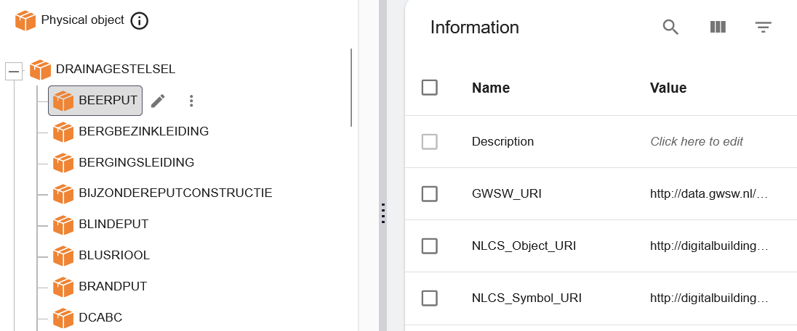

# NLCS-GWSW

In de beheeromgeving worden onder de PhysicalObjects eerst de gwsw:StelselTypes gemodelleerd met de gwsw:Types als onderliggend object. Beide PhysicalObjects hebben een informatie attribuut genaamd GWSW_URI die hun oorspronkelijke URI uit de GWSW bevat. De gwsw:Types hebben daarnaast ook nog een informatie attribuut NLCS_Object_URI en eventueel NLCS_Symbool_URI met de originele URIs van deze NLCS concepten.

<figure>

<figcaption>De beheeromgeving GWSW en NLCS</caption>
</figure>