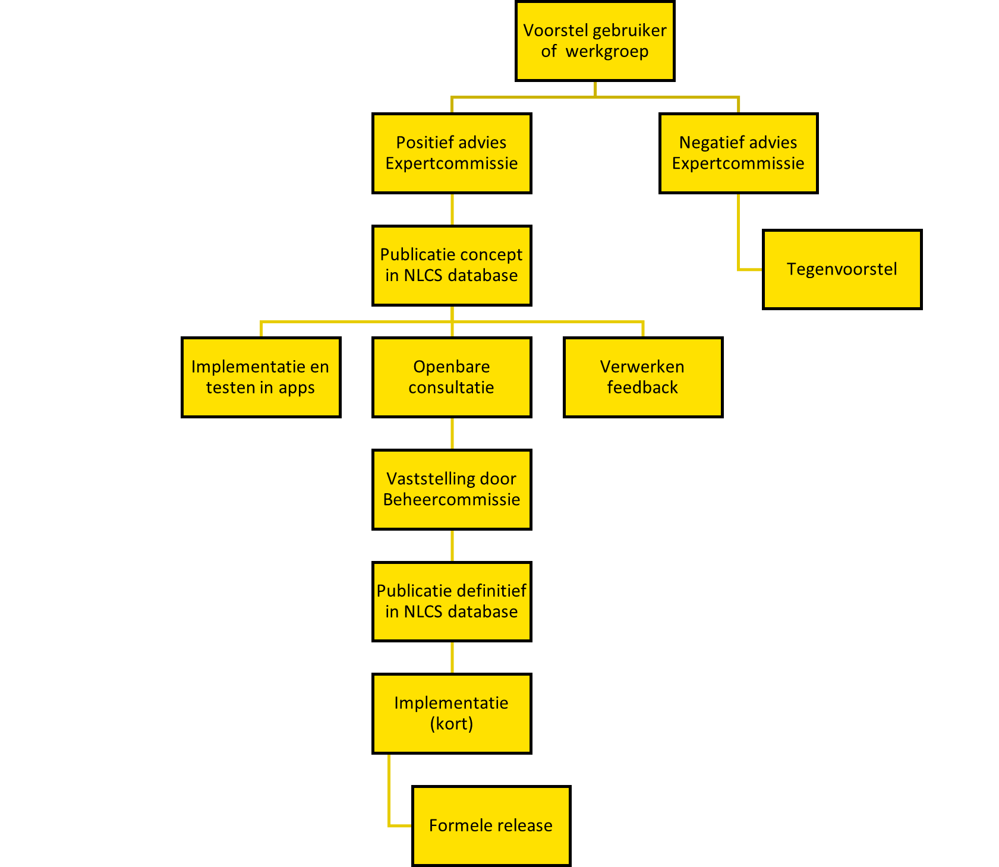

# Inleiding

## Doel documentatie
Dit document beschrijft het releaseprotocol van de <abbr title="Nederlandse CAD-standaard">NLCS</abbr>.

<figure>

<figcaption>Releaseprotocol</caption>
</figure>

## Wijzigingsvoorstel uitwerken

### Gebruikerswensen
Een gebruiker dient voorstellen in voor een (onderdeel van) een release van NLCS, in de vorm van issues op Github.

### Rol inhoudelijke werkgroep 
Een inhoudelijke werkgroep kan samenwerken aan een voorstel voor het toeoegen of wijzigen van een specifieke groep objecten of een technisch onderdeel van NLCS.

Topevoegen of wijzigen van objecten:
1. Laagtabellen 
2. Symbolen bibliotheek 
3. Aanvullende bibliotheken (Linestyles, Arceringen) 

### Release volgen in Github 
Voorafgaand aan een potentiële release wordt deze in GitHub opgenomen als [Milestone](https://github.com/nl-digigo/NLCS/milestones). De issues die in de release worden afgehandeld, worden gekoppeld aan deze milestone.

## Advies expertcommissie
Taken expertcommissie: 
* de inhoud van de database uit te werken en te beoordelen: welke objecten, symbolen en arceringen men wil opnemen, welke kleuren en lijnstijlen gewenst zijn
* technische problemen of wensen voor uitbreiding van de technische werking van NLCS te agenderen bij de Beheercommissie, die de technische commissie kan vragen om deze uit te werken.

De geselecteerde inhoudelijke issues in een release worden één voor één beoordeeld door de expertcommissie. Als het voorstel past binnen de structuur en werkwijze van NLCS en het betreft slechts een uitbreiding van objecten, kan de expertcommissie direct een positief advies geven. Bij fundamentele beslissingen die de werking van de standaard aanpassen of uitbreiden wordt de keuze voorgelegd aan de beheercommissie. Vervolgens wordt de issue afgehandeld, met de uitwerking klaar in de beheeromgeving voor de release van een concept-publicatie.

Issues worden afgehandeld volgens [dit protocol](https://github.com/nl-digigo/NLCS/blob/main/instructies/RASCI%20Github%20issues%20NLCS.pdf).

## Advies technische commissie
Taak technische commissie:

* Gewenste technische aanpassingen aan de standaard (deze worden vastgesteld door de beheercommissie) technisch uit te werken, te beoordelen op impact op de software en een redelijke implementatietermijn bepalen.
* Een roadmap opstellen en bijhouden waarin de aanpassingen aan NLCS (inclusief grote bulkhoeveelheden inhoudelijke wijzigingen in de database) worden toegewezen aan releases, waarmee de implementatietermijn afgesproken wordt en voor iedereen helder is waar aan gewerkt moet worden.

### Tegenvoorstel
Als een door een inhoudelijke werkgroep of gebruiker ingediende uitbreiding van NLCS volgens de expertcommissie niet past binnen NLCS, doet zij een tegenvoorstel zodat de werkgroep richting krijgt voor het uitwerken van een voorstel dat wel binnen de scope van NLCS past.

## Publicatie concept
Na positief advies van de expertcommissie en de technische commissie worden issues verwerkt en wordt een concept-release gepubliceerd. Hierna worden drie parallelle trajecten gelijktijdig opgestart:

* Openbare consultatie
* Test-implementatie softwareleveranciers
* Verwerken issues in definitieve publicatie

## Openbare consultatie
Een openbare consultatie wordt gehouden om feedback te verzamelen van belanghebbenden.

## Test-implementatie softwareleveranciers
Vóór de definitieve publicatie wordt samen met de leveranciers getest, inclusief compatibiliteit met tekeningen van de twee eerdere versies die vanaf dat moment worden ondersteund.

## Verwerken issues
Eventuele nieuwe issues die tijdens de testfase naar voren komen, worden door de expertcommissie beoordeeld. Bij een positief advies worden de issue verwerkt voor de definitieve release.

## Publicatie definitief
Na succesvolle tests en verwerking van issues wordt de definitieve versie gepubliceerd.

## Implementatieperiode
Er volgt een implementatieperiode waarin CAD softwareleveranciers zich voorbereiden op de overgang naar de nieuwe versie. Deze periode kan reltief kort duren, omdat de concept-release al eerder is geimplementeerd en getest. 

## Formele release
Op het vastgestelde moment van formele release kunnen eindgebruikers van CAD-software aan de slag met de nieuwe versie van de standaard.

